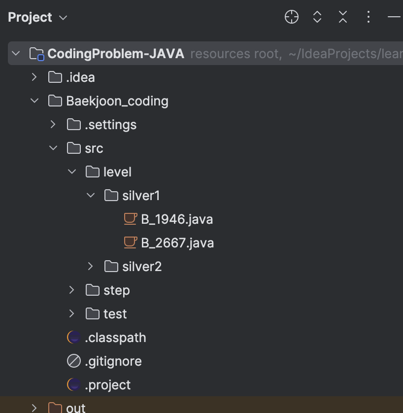
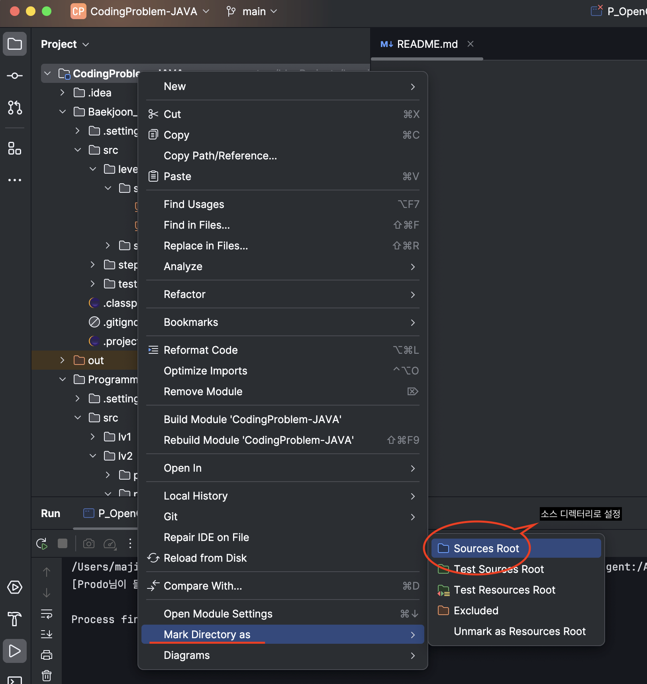
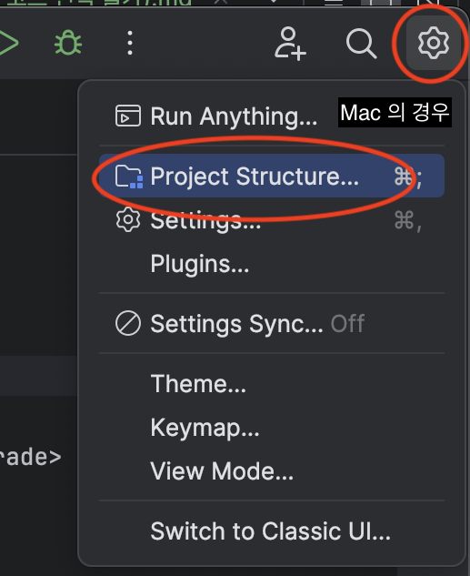
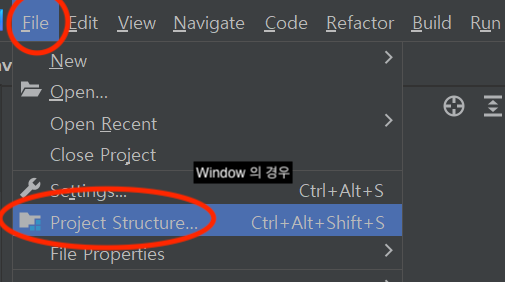
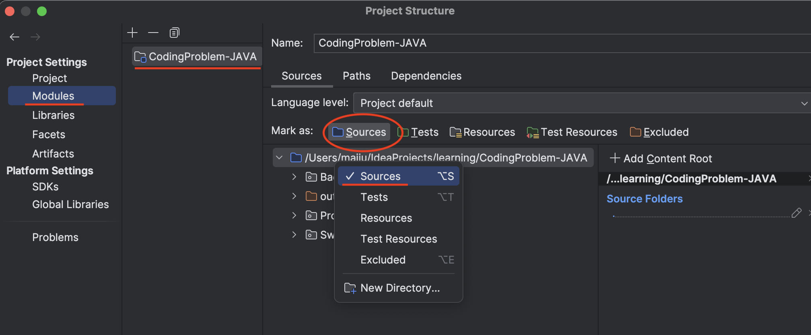

# 💚 [2024-03-26]
## 1. Intellj 에서 java class 로 안보일 때(소스 코드 인식 안됨)
### (1) 문제 상황

 : intellj 에 새로운 환경을 구축했으나, java 파일로와 main 이 실행이 되지 않았다.
  

Intellj 에서 소스 코드 인식이 불가능 한 상황

<pre>
인텔리 제이에서 소스 코드 인식이 불가능한 상황은
1. 인텔리제이 프로젝트로 생성한 프로젝트가 아니거나, 
2. 아무것도 없는 프로젝트를 생성한 경우

가 있으며, 이때 인텔리제이가 소스 코드가 들어있는 폴더를 
자동으로 소스코드다 지정을 하지 못해 위 와 같은 경우가 생긴다.
</pre>

### (2) 해결 방법
<pre>
처음엔, Configuration 이 존재 하지 않아 생긴 문제인 줄 알았으나, 
생각해보니 현재 프로젝트의 소스 코드를 인텔리제이에서 인식을 하지 못해 생긴 것이라는 걸 파악하고, 
폴더를 소스 디렉토리로 변환 시켜 main 을 실행 할 수 있게 되었다.

<b>[해당 폴더 우클릭해서 컨텍스트 메뉴 띄우기 > Mark Directory as > Sources Root]</b>
</pre>
### (2-1) Mark Directory as

<b>[해당 폴더 우클릭해서 컨텍스트 메뉴 띄우기 > Mark Directory as > Sources Root]</b>
<pre>위와 같이 설정하면, 인텔리제이가 컴파일할 소스코드가 있는 폴더로 인식되서 해결된다.</pre>

### (2-1) File > Project Structure > Modules 설정
<b>[인텔리 제이 상단 톱니바퀴 or File 버튼 누르기 > Project Structure 클릭 해 프로젝트 세팅창 열기]</b>  

<b>[위와 같이 화면을 열고 > Modules > 해당 모듈에 포함된 폴더 확인 후, 적용하고자 하는 폴더 클릭 > 해당 폴더에 Sources 항목 체크]</b>  

<pre>Project Structure > Modules 탭을 누르면 해당 모듈에 포함된 폴더들을 확인 할 수 있게 된다.
이 페이지에서는 설정한 소스 디렉토리를 확인 할 수 있으며, 
모듈에 포함된 폴더를 원하고자 하는 역할에 맡게 종류를 지정할 수 있게 된다.
</pre>
